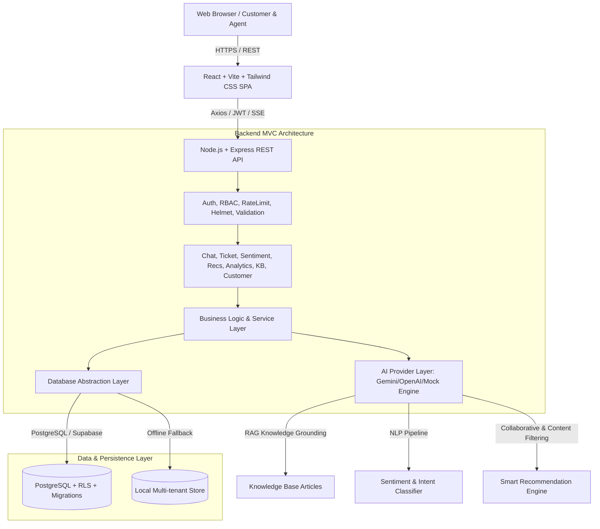
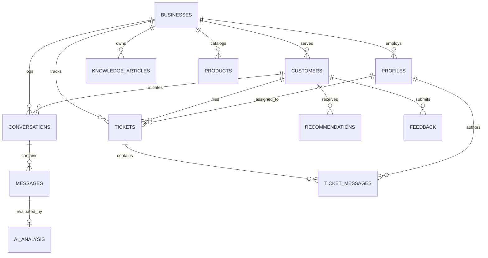

# CX Intelligence - Architecture & System Design Specification

## 1. System Overview
**CX Intelligence** is a multi-tenant, AI-powered Customer Experience Platform designed to bridge customer communication, intelligent automated support, agent ticketing, sentiment intelligence, product recommendations, and real-time business analytics.

## 2. Multi-Tenant Role-Based Access Control (RBAC)
Every entity is partitioned by `business_id` (UUID). Row-Level Security (RLS) policies and backend middleware guarantee strict isolation between organizations.

| Role | Access Scope | Key Capabilities |
| :--- | :--- | :--- |
| **Admin** | Business-wide | Full analytics, team & agent management, knowledge base management, AI tone & policy configuration, ticket reassignment, billing & settings. |
| **Support Agent** | Assigned / Queue | View tickets, reply to customers, add internal notes, escalate issues, review customer sentiment & conversation history. |
| **Customer** | Self-tenant | Self-service chat with AI assistant, real-time ticket creation, track ticket status, receive grounded product recommendations, submit satisfaction ratings. |

## 3. Entity-Relationship Data Model

## 4. AI & Grounding Pipeline
1. **Chatbot Retrieval-Augmented Generation (RAG)**:
   - Matches customer queries against published business knowledge articles using semantic/lexical vector scoring.
   - Grounded context injection: strict system instructions prohibit hallucinations regarding pricing, policies, and availability.
   - If confidence falls below 0.65, triggers graceful uncertainty fallback and offers 1-click human support escalation.
2. **Sentiment & Intent Engine**:
   - Classifies customer inputs into `positive`, `neutral`, `negative` with numerical confidence (0.00 - 1.00).
   - Detects primary intent (`technical_issue`, `billing_inquiry`, `product_question`, `refund_request`, `complaint`, `general`).
   - Flags negative sentiment threshold violations for prioritized ticket creation.
3. **Recommendation Engine**:
   - Cross-analyzes customer stated preferences, tags, conversation sentiment, and category affinity.
   - Returns ranked items with human-readable rationale ("Because you frequently asked about Cloud Security...").

## 5. Security Architecture
- **Authentication**: Supabase Auth + JWT Bearer token verification.
- **Password Security**: bcrypt (12 rounds) for local credential hashing.
- **HTTP Hardening**: Helmet (CSP, HSTS, X-Content-Type-Options), CORS with whitelisted origins, Rate Limiting (100 reqs/15 min on standard APIs; 20 reqs/15 min on auth).
- **Validation**: Strict schema validation with Zod on both client and server boundaries.
- **Data Isolation**: All queries enforce `WHERE business_id = $1`.
